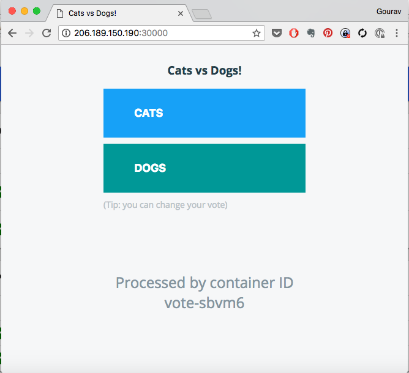

# Exposing Application with  a Service

Types of Services:   

  * ClusterIP
  * NodePort
  * LoadBalancer
  * ExternalName


```
kubectl get pods
kubectl get svc
```

Sample Output:
```
NAME                READY     STATUS    RESTARTS   AGE
voting-appp-1j52x   1/1       Running   0          12m
voting-appp-pr2xz   1/1       Running   0          9m
voting-appp-qpxbm   1/1       Running   0          15m
```


### Setting up monitoring

If you are not running a monitoring screen, start it in a new terminal with the following command.

```
watch -n 1 kubectl get  pod,deploy,rs,svc
```

## Writing Service Spec


Lets start writing the  meta information for service.  

Filename: vote-svc.yaml

```
---
apiVersion: v1
kind: Service
metadata:
  name: vote
  labels:
    role: vote
spec:
```

And then add the spec to it. Refer to Service (v1 core) api at this page https://kubernetes.io/docs/reference/generated/kubernetes-api/v1.10/

```
---
apiVersion: v1
kind: Service
metadata:
  name: vote
  labels:
    role: vote
spec:
  selector:
    role: vote
  ports:
    - port: 80
      targetPort: 80
      nodePort: 30000
  type: NodePort

```

Save the file.

Now to create a service:

```
kubectl apply -f vote-svc.yaml --dry-run
kubectl apply -f vote-svc.yaml
kubectl get svc
```

Now to check which port the pod is connected
```
kubectl describe service vote
```
Check for the Nodeport here

Sample Output
```
Name:                     vote
Namespace:                instavote
Labels:                   role=svc
                          tier=front
Annotations:              kubectl.kubernetes.io/last-applied-configuration={"apiVersion":"v1","kind":"Service","metadata":{"annotations":{},"labels":{"role":"svc","tier":"front"},"name":"vote","namespace":"instavote"},"spec":{...
Selector:                 app=vote
Type:                     NodePort
IP:                       10.108.108.157
Port:                     <unset>  80/TCP
TargetPort:               80/TCP
NodePort:                 <unset>  31429/TCP
Endpoints:                10.38.0.4:80,10.38.0.5:80,10.38.0.6:80 + 2 more...
Session Affinity:         None
External Traffic Policy:  Cluster
Events:                   <none>
```

Go to browser and check hostip:NodePort

Here the node port is 31429.

Sample output will be:



## Exposing the app with ExternalIP

```
spec:
  selector:
    role: vote
  ports:
  - port: 80
    protocol: TCP
    targetPort: 80
  type: NodePort
  externalIPs:
    - xx.xx.xx.xx
    - yy.yy.yy.yy
```

Where

replace xx.xx.xx.xx and yy.yy.yy.yy with IP addresses of the nodes on two of the kubernetes hosts.


apply
```
kubectl  get svc
kubectl apply -f vote-svc.yaml
kubectl  get svc
kubectl describe svc vote
```

[sample output]

```
NAME      TYPE       CLUSTER-IP      EXTERNAL-IP                    PORT(S)        AGE
vote      NodePort   10.107.71.204   206.189.150.190,159.65.8.227   80:30000/TCP   11m
```

where,

EXTERNAL-IP column shows which IPs the application is been exposed on. You could go to http://<IPADDRESS>:<SERVICE_PORT> to access this application.  e.g. http://206.189.150.190:80 where you should replace 206.189.150.190 with the actual IP address of the node that you exposed this on.

## Internal Service Discovery


  * Visit the vote app from browser
  * Attemp to vote by clicking on one of the options

observe what happens. Does it go through?  


Debugging,


```
kubectl get pod
kubectl exec vote-xxxx ping redis

```
[replace xxxx with the actual pod id of one of the vote pods ]

keep the above command on a watch. You should create a new terminal to run the watch command.

e.g.

```
watch  kubectl exec vote-kvc7j ping redis
```
where, vote-kvc7j is one of the vote pods that I am running. Replace this with the actual pod id.


Now create **redis** service

```
kubectl apply -f redis-svc.yaml

kubectl get svc

kubectl describe svc redis
```

Watch the ping and observe if its able to resolve **redis** by hostname and its pointing to an IP address.

e.g.

```
PING redis (10.102.77.6): 56 data bytes
```

where **10.102.77.6** is the ClusterIP assigned to the service.  

What happened here?

  * Service **redis** was created with a ClusterIP e.g. 10.102.77.6
  * A DNS entry was created for this service. The fqdn of the service is **redis.instavote.svc.cluster.local** and it takes the form of my-svc.my-namespace.svc.cluster.local
  * Each pod points to  internal  DNS server running in the cluster. You could see the details of this by running the following commands


```
kubectl exec vote-xxxx cat /etc/resolv.conf
```
[replace vote-xxxx with actual pod id]

[sample output]
```
nameserver 10.96.0.10
search instavote.svc.cluster.local svc.cluster.local cluster.local
options ndots:5
```

where **10.96.0.10** is the ClusterIP assigned to the DNS service. You could co relate that with,

```
kubectl get svc -n kube-system


NAME                   TYPE        CLUSTER-IP     EXTERNAL-IP   PORT(S)         AGE
kube-dns               ClusterIP   10.96.0.10     <none>        53/UDP,53/TCP   1h
kubernetes-dashboard   NodePort    10.104.42.73   <none>        80:31000/TCP    23m

```

where, **10.96.0.10** is the ClusterIP assigned to **kube-dns** and matches the configuration in **/etc/resolv.conf** above.

##### Creating Endpoints for Redis

Service is been created, but you still need to launch the actual pods running **redis** application.

Create the endpoints now,

```
kubectl apply -f redis-deploy.yaml
kubectl describe svc redis

```

[sample output]

```
Name:              redis
Namespace:         instavote
Labels:            role=redis
                   tier=back
Annotations:       kubectl.kubernetes.io/last-applied-configuration={"apiVersion":"v1","kind":"Service","metadata":{"annotations":{},"labels":{"role":"redis","tier":"back"},"name":"redis","namespace":"instavote"},"spec"...
Selector:          app=redis
Type:              ClusterIP
IP:                10.102.77.6
Port:              <unset>  6379/TCP
TargetPort:        6379/TCP
Endpoints:         10.32.0.6:6379,10.46.0.6:6379
Session Affinity:  None
Events:            <none>
```

Again, visit the vote app from browser, attempt to register your vote  and observe what happens now.
