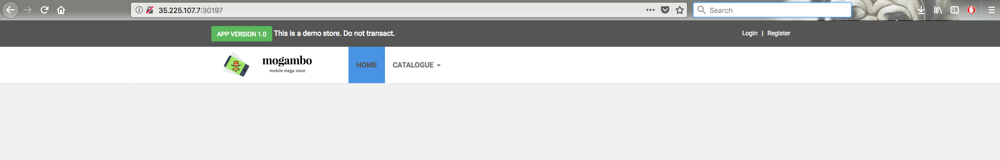

# Exposing Application with  a Service

Types of Services:   

  * ClusterIP
  * NodePort
  * LoadBalancer
  * ExternalName


```
kubectl get pods
kubectl get svc
```

Sample Output:
```
NAME                READY     STATUS    RESTARTS   AGE
voting-appp-1j52x   1/1       Running   0          12m
voting-appp-pr2xz   1/1       Running   0          9m
voting-appp-qpxbm   1/1       Running   0          15m
```


### Setting up monitoring

If you are not running a monitoring screen, start it in a new terminal with the following command.

```
watch -n 1 kubectl get  pod,deploy,rs,svc
```

## Writing Service Spec


Lets start writing the  meta information for service.  

Filename: vote-svc.yaml

```
---
apiVersion: v1
kind: Service
metadata:
  name: vote
  labels:
    role: vote
spec:
```

And then add the spec to it. Refer to Service (v1 core) api at this page https://kubernetes.io/docs/reference/generated/kubernetes-api/v1.10/

```
---
apiVersion: v1
kind: Service
metadata:
  name: vote
  labels:
    role: vote
spec:
  selector:
    role: vote
    version: v1
  ports:
    - port: 80
      targetPort: 80
      nodePort: 30000
  type: NodePort

```

Save the file.

Now to create a service:

```
kubectl apply -f vote-svc.yaml --dry-run
kubectl apply -f vote-svc.yaml
kubectl get svc
```

Now to check which port the pod is connected
```
kubectl describe service vote
```
Check for the Nodeport here

Sample Output
```
Name:                     vote
Namespace:                instavote
Labels:                   role=svc
                          tier=front
Annotations:              kubectl.kubernetes.io/last-applied-configuration={"apiVersion":"v1","kind":"Service","metadata":{"annotations":{},"labels":{"role":"svc","tier":"front"},"name":"vote","namespace":"instavote"},"spec":{...
Selector:                 app=vote
Type:                     NodePort
IP:                       10.108.108.157
Port:                     <unset>  80/TCP
TargetPort:               80/TCP
NodePort:                 <unset>  31429/TCP
Endpoints:                10.38.0.4:80,10.38.0.5:80,10.38.0.6:80 + 2 more...
Session Affinity:         None
External Traffic Policy:  Cluster
Events:                   <none>
```

Go to browser and check hostip:NodePort

Here the node port is 31429.

Sample output will be:



## Exposing the app with ExternalIP

```
spec:
  selector:
    app: vote
  ports:
  - port: 80
    protocol: TCP
    targetPort: 80
  type: NodePort
  externalIPs:
    - xx.xx.xx.xx
    - yy.yy.yy.yy
```

Where

replace xx.xx.xx.xx and yy.yy.yy.yy with IP addresses of the nodes on two of the kubernetes hosts.


apply
```
kubectl apply -f vote-svc.yaml
kubectl  get svc
kubectl describe svc vote
```

## Internal Service Discovery


Visit the vote app from browser, vote and observe what happens.

```
kubectl exec vote-xxxx ping redis

```
[replace xxxx with the actual pod id of one of the vote pods ]

keep the above command on a watch.


```
kubectl apply -f redis-svc.yaml

kubectl get svc

kubectl describe svc redis
```

Watch the ping and observe if its able to resolve **redis** by hostname.


Create the endpoints now,

```
kubectl apply -f redis-deploy.yaml
```

Again, visit the vote app from browser, vote and observe what happens now. 
