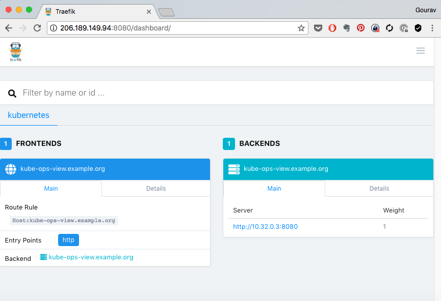
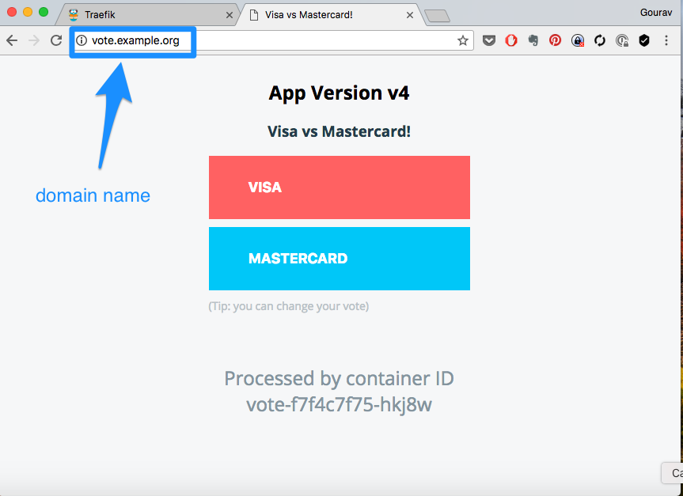

# Ingress


## Pre Requisites

  * Ingress controller such as Nginx, Trafeik needs to be deployed before creating ingress resources.
  * On GCE, ingress controller runs on the master. On all other installations, it needs to be deployed, either as a deployment, or a daemonset. In addition, a service needs to be created for ingress.
  * Daemonset will run ingress on each node. Deployment will just create a highly available setup, which can then be exposed on specific nodes using ExternalIPs configuration in the service.

### Create a Ingress Controller

An ingress controller needs to be created in order to serve the ingress requests. Kubernetes comes with support for **GCE** and **nginx** ingress controllers, however additional softwares are commonly used too.  As part of this implementation you are going to use [Traefik](https://traefik.io/) as the ingress controller. Its a fast and lightweight ingress controller and also comes with great documentation and support.  

```bash


+----+----+--+            
| ingress    |            
| controller |            
+----+-------+            


```

There are commonly two ways you could deploy an ingress

  * Using Deployments with HA setup
  * Using DaemonSets which run on every node

We pick **DaemonSet**, which will ensure that one instance of **traefik** is run on every node.  Also, we use a specific configuration **hostNetwork** so that the pod running **traefik** attaches to the network of underlying host, and not go through **kube-proxy**. This would avoid extra network hop and increase performance  a bit.  

Deploy ingress controller with daemonset as

```
cd k8s-code/ingress/traefik

kubectl get ds -n kube-system

kubectl apply -f traefik-rbac.yaml
kubectl apply -f traefik-ds.yaml
```

Validate
```
kubectl get svc,ds,pods -n kube-system  --selector='k8s-app=traefik-ingress-lb'
```

[output]

```
NAME                              TYPE        CLUSTER-IP       EXTERNAL-IP   PORT(S)           AGE
service/traefik-ingress-service   ClusterIP   10.109.182.203   <none>        80/TCP,8080/TCP   11h

NAME                                              DESIRED   CURRENT   READY     UP-TO-DATE   AVAILABLE   NODE SELECTOR   AGE
daemonset.extensions/traefik-ingress-controller   2         2         2         2            2           <none>          11h

NAME                                   READY     STATUS    RESTARTS   AGE
pod/traefik-ingress-controller-bmwn7   1/1       Running   0          11h
pod/traefik-ingress-controller-vl296   1/1       Running   0          11h
```

You would notice that the ingress controller is started on all nodes (except managers). Visit any of the nodes 8080 port e.g. http://IPADDRESS:8080 to see  traefik's management UI.



### Setting up Named Based Routing for Vote App

We will direct all our request to the ingress controller now, but with differnt hostname e.g. **vote.example.org** or **results.example.org**. And it should direct to the correct service based on the host name.

In order to achieve this you, as a user would create a **ingress** object with a set of rules,


```bash


+----+----+--+            
| ingress    |            
| controller |            
+----+-------+            
     |              +-----+----+
     +---watch----> | ingress  | <------- user
                    +----------+

```


`file: vote-ing.yaml`

```
apiVersion: extensions/v1beta1
kind: Ingress
metadata:
  name: vote
  annotations:
    kubernetes.io/ingress.class: traefik
    ingress.kubernetes.io/auth-type: "basic"
    ingress.kubernetes.io/auth-secret: "mysecret"
spec:
  rules:
    - host: vote.example.org
      http:
        paths:
          - path: /
            backend:
              serviceName: vote
              servicePort: 82
    - host: results.example.org
      http:
        paths:
          - path: /
            backend:
              serviceName: results
              servicePort: 81
```

And apply

```
kubectl get ing
kubectl apply -f vote-ing.yaml --dry-run
kubectl apply -f vote-ing.yaml
```

Since the ingress controller  is constantly monitoring for the ingress objects, the moment it detects, it connects with traefik and creates a rule as follows.


```bash

                    +----------+
     +--create----> | traefik  |
     |              |  rules   |
     |              +----------+
+----+----+--+            ^
| ingress    |            :
| controller |            :
+----+-------+            :
     |              +-----+----+
     +---watch----> | ingress  | <------- user
                    +----------+

```

where,

  * A user creates a ingress object with the rules. This could be a named based or a path based routing.
  * An ingress controller, in this example traefik constantly monitors for ingress objects. The moment it detects one, it creates a rule and adds it to the traefik load balancer. This rule maps to the ingress specs.


You could now see the rule added to ingress controller,


Where,

  * **vote.example.org** and **results.example.org** are added as frontends. These frontends point to respective services **vote** and **results**.

  * respective backends also appear on the right hand side of the screen, mapping to each of the service.

#### Adding Local DNS

You have created the ingress rules based on hostnames e.g.  **vote.example.org** and **results.example.org**. In order for you to be able to access those, there has to be a dns entry pointing to your nodes, which are running traefik.

```bash

  vote.example.org     -------+                        +----- vote:81
                              |     +-------------+    |
                              |     |   ingress   |    |
                              +===> |   node:80   | ===+
                              |     +-------------+    |
                              |                        |
  results.example.org  -------+                        +----- results:82

```

To achieve this you need to either,

  * Create a DNS entry, provided you own the domain and have access to the dns management console.
  * Create a local **hosts** file entry. On unix systems its in `/etc/hosts` file. On windows its at `C:\Windows\System32\drivers\etc\hosts`. You need admin access to edit this file.


For example, on a linux or osx, you could edit it as,

```
sudo vim /etc/hosts
```

And add an entry such as ,

```
xxx.xxx.xxx.xxx vote.example.org results.example.org
```

where,

  * xxx.xxx.xxx.xxx is the actual IP address of one of the nodes running traefik.

And then access the app urls using http://vote.example.org or http://results.example.org




### Adding HTTP Authentication with Annotations


#### Creating htpasswd spec as Secret   


```
htpasswd -c auth devops
```


Or use [Online htpasswd generator](http://www.htaccesstools.com/htpasswd-generator/) to generate a htpasswd spec. if you use the online generator, copy the contents to a file by name `auth` in the current directory.

Then generate the secret as,

```
kubectl create secret generic mysecret --from-file auth

kubectl get secret

kubectl describe secret mysecret
```

And then add annotations to the ingress object so that it is read by the ingress controller to update configurations.

`file: vote-ing.yaml`

```
apiVersion: extensions/v1beta1
kind: Ingress
metadata:
  name: vote
  annotations:
    kubernetes.io/ingress.class: traefik
    ingress.kubernetes.io/auth-type: "basic"
    ingress.kubernetes.io/auth-secret: "mysecret"
spec:
  rules:
    - host: vote.example.org
      http:
        paths:
          - path: /
            backend:
              serviceName: vote
              servicePort: 82
    - host: results.example.org
      http:
        paths:
          - path: /
            backend:
              serviceName: results
              servicePort: 81

```

where,

  *  *ingress.kubernetes.io/auth-type: "basic"* defines authentication type that needs to be added.
  *  *ingress.kubernetes.io/auth-secret: "mysecret"* refers to the secret created earlier.

apply

```
kubectl apply -f vote-ing.yaml
kubectl get ing/vote -o yaml
```

Observe the annotations field. No sooner than you apply this spec, ingress controller reads the event and a basic http authentication is set with the secret you added.


```bash

                      +----------+
       +--update----> | traefik  |
       |              |  configs |
       |              +----------+
  +----+----+--+            ^
  | ingress    |            :
  | controller |            :
  +----+-------+            :
       |              +-----+-------+
       +---watch----> | ingress     | <------- user
                      | annotations |
                      +-------------+
```

And if you visit traefik's dashboard and go to the details tab, you should see the basic authentication section enabled as in the diagram below.


##### Reading

  * [Trafeik's Guide to Kubernetes Ingress Controller](https://docs.traefik.io/user-guide/kubernetes/)
  * [Annotations](https://kubernetes.io/docs/concepts/overview/working-with-objects/annotations/)
  * [DaemonSets](https://kubernetes.io/docs/concepts/workloads/controllers/daemonset/)

**References**

  * [Online htpasswd generator](http://www.htaccesstools.com/htpasswd-generator/)

**Keywords**

  * trafeik on kubernetes
  * kubernetes ingress
  * kubernetes annotations
  * daemonsets
