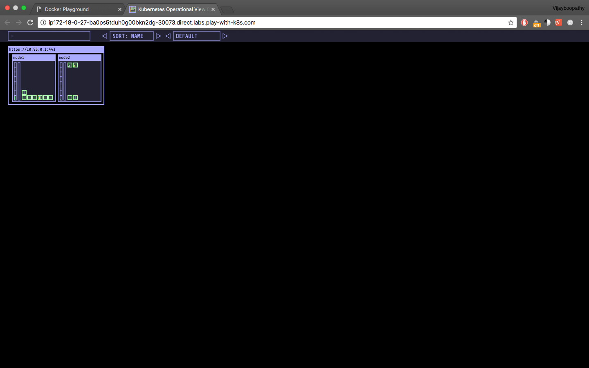

## Kubernetes Visualizer

In this chapter we will see how to set up kubernetes visualizer that will show us the changes in our cluster in real time.

### Set up

Fork the repository and deploy the visualizer on kubernetes


```
git clone  https://github.com/schoolofdevops/kube-ops-view
kubectl apply -f kube-ops-view/deploy/

```

[Sample Output]

```
serviceaccount "kube-ops-view" created
clusterrole "kube-ops-view" created
clusterrolebinding "kube-ops-view" created
deployment "kube-ops-view" created
ingress "kube-ops-view" created
deployment "kube-ops-view-redis" created
service "kube-ops-view-redis" created
service "kube-ops-view" created
```

Get the nodeport for the service.

```
kubectl get svc

[output]
NAME                  TYPE        CLUSTER-IP      EXTERNAL-IP   PORT(S)        AGE
kube-ops-view         NodePort    10.107.204.74   <none>        80:**30073**/TCP   1m
kube-ops-view-redis   ClusterIP   10.104.50.176   <none>        6379/TCP       1m
kubernetes            ClusterIP   10.96.0.1       <none>        443/TCP        8m
```

In my case, port **30073** is the nodeport.

Visit the port from the browser. You could add /#scale=2.0 or similar option where 2.0 = 200% the scale.

```
http://<NODE_IP:NODE_PORT>/#scale=2.0
```


