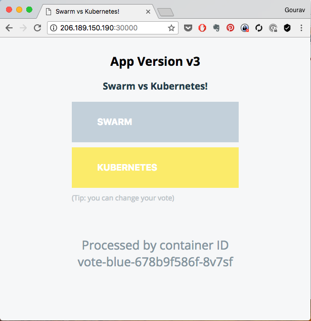
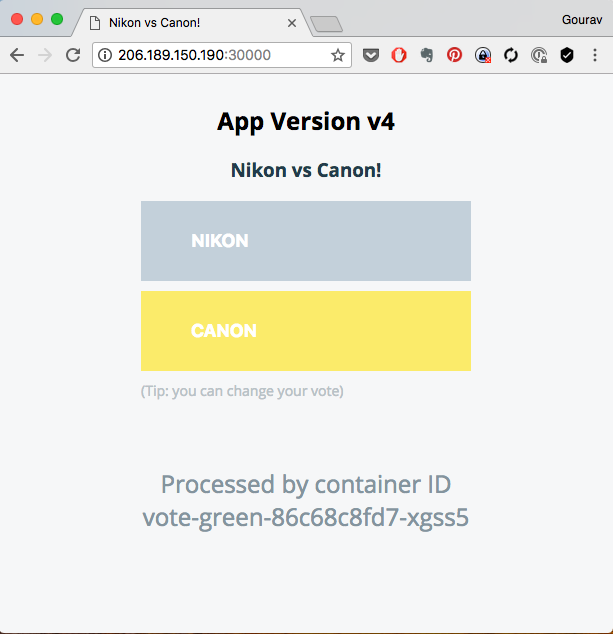

# Release Strategies

## Releases with downtime using Recreate Strategy

When the **Recreate** deployment strategy is used,
  * The old pods will be deleted
  * Then the new pods will be created.

This will create some downtime in our stack.

Let us change the deployment strategy to **recreate** and image tag to *v4*.

```
cp vote-deploy.yaml vote-deploy-recreate.yaml
```

And edit the specs with following changes

  * Update strategy to **Recreate**
  * Remove rolling update specs


`file: vote-deploy-recreate.yaml`

```
apiVersion: apps/v1
kind: Deployment
metadata:
  name: vote
spec:
  strategy:
    type: Recreate
  revisionHistoryLimit: 4
  paused: false
  replicas: 15
  minReadySeconds: 20
  selector:
    matchLabels:
      role: vote
    matchExpressions:
      - {key: version, operator: In, values: [v1, v2, v3, v4]}
  template:
    metadata:
      name: vote
      labels:
        app: python
        role: vote
        version: v4
    spec:
      containers:
        - name: app
          image: schoolofdevops/vote:v4
          ports:
            - containerPort: 80
              protocol: TCP
```

and apply
```
kubectl get pods,rs,deploy,svc

kubectl apply -f vote-deploy-recreate.yaml

kubectl rollout status deplloyment/vote

```

While the deployment happens, use the monitoring/visualiser and observe the manner in which the deployment gets updated.

You would observe that

  * All pods wit the current version are deleted first
  * Only after all the existing pods are deleted, pods with new version are launched


## Canary  Releases

```
cd k8s-code/projets/instavote/dev
mkdir canary
cp vote-deploy.yaml canary/vote-canary-deploy.yaml

```

change the following fields in *vote-canary-deploy.yaml*

  * metadata.name: vote-canary
  * spec.replicas: 3
  * spec.selector.matchExpressions: - {key: version, operator: In, values: [v1, v2, v3, v4]}
  * template.metadata.labels.version: v4
  * template.spec.containers.image: schoolofdevops/vote:v4

File: canary/frontend-canary-deploy.yml


```
apiVersion: apps/v1
kind: Deployment
metadata:
  name: vote-canary
spec:
  strategy:
    type: RollingUpdate
    rollingUpdate:
      maxSurge: 2
      maxUnavailable: 1
  revisionHistoryLimit: 4
  paused: false
  replicas: 3
  selector:
    matchLabels:
      role: vote
    matchExpressions:
      - {key: version, operator: In, values: [v1, v2, v3, v4, v5]}
  minReadySeconds: 40
  template:
    metadata:
      name: vote
      labels:
        app: python
        role: vote
        version: v4
    spec:
      containers:
        - name: app
          image: schoolofdevops/vote:v4
          ports:
            - containerPort: 80
              protocol: TCP
```

Before creating this deployment, find out how many endpoints the service has,

```
kubectl describe service/vote
```

[sample output ]

```
Endpoints:                10.32.0.10:80,10.32.0.11:80,10.32.0.4:80 + 12 more...
```

In this example current endpoints are **15**

Now create the  deployment for canary release

```

kubectl apply -f canary/frontend-canary-deploy.yml

```

And validate,

```
kubectl get rs,deploy,svc

kubectl describe service/vote
```

When you describe vote service, observe the number of endpoints

[sample output]
```
Endpoints:                10.32.0.10:80,10.32.0.11:80,10.32.0.16:80 + 15 more...
```

Now its **18**, which is 3 more than the previous number. Those are the pods created by the canary deployment. And the above output proves that its actually sending traffic to both versions.

#### Delete Canary

Once validated, you could clean up canary release using

```
kubectl delete -f canary/vote-canary-deploy.yaml
```


## Blue/Green  Releases


Before proceeding, lets clean up the existing deployment.

```
kubectl delete deploy/vote
kubectl delete svc/vote
kubectl get pods,deploy,rs,svc

```

And create the work directory for blue-green release definitions.

```
cd k8s-code/projets/instavote/dev
mkdir blue-green

```

file: blue-green/vote-blue-deploy.yaml

```
apiVersion: apps/v1
kind: Deployment
metadata:
  name: vote-blue
spec:
  strategy:
    type: RollingUpdate
    rollingUpdate:
      maxSurge: 2
      maxUnavailable: 1
  revisionHistoryLimit: 4
  paused: false
  replicas: 15
  minReadySeconds: 20
  selector:
    matchLabels:
      role: vote
    matchExpressions:
      - {key: version, operator: In, values: [v1, v2, v3]}
  template:
    metadata:
      name: vote
      labels:
        app: python
        role: vote
        version: v3
        release: bluegreen
        code: blue
    spec:
      containers:
        - name: app
          image: schoolofdevops/vote:v3
          ports:
            - containerPort: 80
              protocol: TCP
```

file: blue-green/vote-green-deploy.yaml
```
apiVersion: apps/v1
kind: Deployment
metadata:
  name: vote-green
spec:
  strategy:
    type: RollingUpdate
    rollingUpdate:
      maxSurge: 2
      maxUnavailable: 1
  revisionHistoryLimit: 4
  paused: false
  replicas: 15
  minReadySeconds: 20
  selector:
    matchLabels:
      role: vote
    matchExpressions:
      - {key: version, operator: In, values: [v1, v2, v3, v4]}
  template:
    metadata:
      name: vote
      labels:
        app: python
        role: vote
        version: v3
        release: bluegreen
        code: green
    spec:
      containers:
        - name: app
          image: schoolofdevops/vote:v4
          ports:
            - containerPort: 80
              protocol: TCP

```

file: blue-green/vote-bg-svc.yaml

```
---
apiVersion: v1
kind: Service
metadata:
  name: vote-bg
  labels:
    role: vote
    release: bluegreen
spec:
  selector:
    role: vote
    release: bluegreen
    code: green
  ports:
    - port: 80
      targetPort: 80
      nodePort: 30001
  type: NodePort

```


file: vote-svc.yaml
```
---
apiVersion: v1
kind: Service
metadata:
  name: vote
  labels:
    role: vote
spec:
  selector:
    role: vote
    release: bluegreen
    code: blue
  ports:
    - port: 80
      targetPort: 80
      nodePort: 30000
  type: NodePort
```

### Creating  blue deployment

Now create **vote** service and observe the endpoints

```
kubectl apply -f vote-svc.yaml
kubectl get svc
kubectl describe svc/vote
```
[sample output]

```
Name:                     vote
Namespace:                instavote
Labels:                   role=vote
Annotations:              kubectl.kubernetes.io/last-applied-configuration={"apiVersion":"v1","kind":"Service","metadata":{"annotations":{},"labels":{"role":"vote"},"name":"vote","namespace":"instavote"},"spec":{"externalIPs":...
Selector:                 code=blue,release=bluegreen,role=vote
Type:                     NodePort
IP:                       10.111.93.227
External IPs:             206.189.150.190,159.65.8.227
Port:                     <unset>  80/TCP
TargetPort:               80/TCP
NodePort:                 <unset>  30000/TCP
Endpoints:                <none>
Session Affinity:         None
External Traffic Policy:  Cluster
Events:                   <none>
```

where,
  * **endpoints** are **None**
  * its selecting pods with **code=blue**

Now lets create the deployment for **blue** release

```
kubectl get pods,rs,deploy
kubectl apply -f blue-green/vote-blue-deploy.yaml
kubectl get pods,rs,deploy
kubectl rollout status deploy/vote-blue
```

[sample output]
```
Waiting for rollout to finish: 2 of 15 updated replicas are available...
deployment "vote-blue" successfully rolled out
```

Now if you check the service, it should have the pods launched with blue set as endpoints

```
kubectl describe svc/vote

Name:                     vote
Namespace:                instavote
Labels:                   role=vote
Annotations:              kubectl.kubernetes.io/last-applied-configuration={"apiVersion":"v1","kind":"Service","metadata":{"annotations":{},"labels":{"role":"vote"},"name":"vote","namespace":"instavote"},"spec":{"externalIPs":...
Selector:                 code=blue,release=bluegreen,role=vote
Type:                     NodePort
IP:                       10.111.93.227
External IPs:             206.189.150.190,159.65.8.227
Port:                     <unset>  80/TCP
TargetPort:               80/TCP
NodePort:                 <unset>  30000/TCP
Endpoints:                10.32.0.10:80,10.32.0.11:80,10.32.0.4:80 + 12 more...
Session Affinity:         None
External Traffic Policy:  Cluster
Events:                   <none>

```

You could observe the **Endpoints** created and added to the service.  Browse to http://IPADDRESS:NODEPORT to see the application deployed.





### Deploying new version with green release

While deploying a new version with blue-green strategy, we would

  * Create a new deployment in parallel
  * Test it by creating another service
  * Cut over to new release by updating selector in the main service

Lets create the deployment with new version and a service to test it. Lets call it the **green** deployment  

```
kubectl apply -f blue-green/vote-bg-svc.yaml
kubectl apply -f blue-green/vote-bg-svc.yaml
kubectl apply -f blue-green/vote-green-deploy.yaml
kubectl rollout status deploy/vote-green

```

[sample output]

```
Waiting for rollout to finish: 0 of 15 updated replicas are available...
Waiting for rollout to finish: 0 of 15 updated replicas are available...
Waiting for rollout to finish: 0 of 15 updated replicas are available...
Waiting for rollout to finish: 0 of 15 updated replicas are available...
Waiting for rollout to finish: 7 of 15 updated replicas are available...
deployment "vote-green" successfully rolled out
```

Validate
```
kubectl get pods,rs,deploy,svc
```

You could also test it by going to the http://host:nodeport for service **vote-bg**


### Switching to new version

Now that you  have the new version running in parallel, you could quickly switch to it by updating selector for main **vote** service which is live. Please note, while switching there may be a momentory downtime.

**Steps**

  * visit http://HOST:NODEPORT for **vote** service
  * update **vote** service to select **green** release
  * apply service definition
  * visit http://HOST:NODEPORT for **vote** service again to validate

file: vote-svc.yaml

```
---
apiVersion: v1
kind: Service
metadata:
  name: vote
  labels:
    role: vote
spec:
  selector:
    role: vote
    release: bluegreen
    code: green
  ports:
    - port: 80
      targetPort: 80
      nodePort: 30000
  type: NodePort

```

Apply it with

```
kubectl apply -f vote-svc.yaml

kubectl describe svc/vote
```

If you visit http://HOST:NODEPORT for **vote** service, you should see the application version updated




#### Clean up the previous version

```
kubectl delete deploy/vote-blue

```


#### Clean up blue-green configs

Now that you are done testing blue green release, lets revert to our previous configurations.

```
kubectl delete deploy/vote-green
kubectl apply -f vote-deploy.yaml

```

Also update the service definition and remove following  selectors added for blue green release

  * release: bluegreen
  * code: blue


`file: vote-svc.yaml`

```
---
apiVersion: v1
kind: Service
metadata:
  name: vote
  labels:
    role: vote
spec:
  selector:
    role: vote
  ports:
    - port: 80
      targetPort: 80
      nodePort: 30000
  type: NodePort
```

And apply

```
kubectl apply -f vote-svc.yaml
```

### Pause/Unpause

When you are in the middle of a new update for your application and you found out that the application is behaving as intended. In those situations,
  1. we can pause the update,
  2. fix the issue,
  3. resume the update.

Let us change the image tag to V4 in pod spec.

`File: vote-deploy.yaml`

```
    spec:
       containers:
         - name: app
           image: schoolofdevops/vote:V4
           ports:
             - containerPort: 80
               protocol: TCP
```

Apply the changes.

```
kubectl apply -f vote-deploy.yaml

kubectl get pods

[Output]
NAME                         READY     STATUS         RESTARTS   AGE
vote-6c4f7b49d8-g5dgc   1/1       Running        0          16m
vote-765554cc7-xsbhs    0/1       ErrImagePull   0          9s
```

Our deployment is failing. From some debugging, we can conclude that we are using a wrong image tag.

Now pause the update

```
kubectl rollout pause deploy/vote
```

Set the deployment to use **v4** version of the image.


Now resume the update

```
kubectl rollout resume deployment vote
kubectl rollout status deployment vote

[Ouput]
deployment "vote" successfully rolled out
```

and validate

```
kubectl get pods,rs,deploy

[Output]
NAME                         READY     STATUS    RESTARTS   AGE
vote-6875c8df8f-k4hls   1/1       Running   0          1m
```

When you do this, you skip the need of creating a new rolling update altogether.
