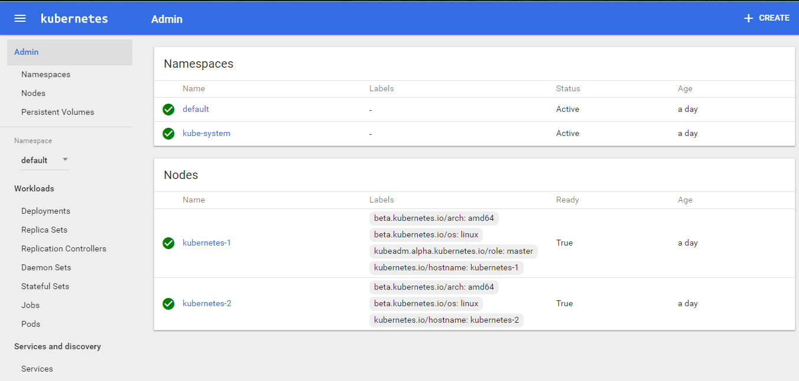

## Compatibility

Kubernetes is an open-source system for automating deployment, scaling, and management of containerized applications.

The below steps are applicabe for the below mentioned OS


| OS | Version | Codename |  
| --- | --- | -- |  
| **Ubuntu** | **16.04** | **Xenial** |  

## Base Setup

** Skip this step and scroll to Initializing Master if you have setup nodes with vagrant**


On all nodes which would be part of this cluster, you need to do the base setup as described here,

### Create Kubernetes Repository

We need to create a repository to download Kubernetes.

```
curl -s https://packages.cloud.google.com/apt/doc/apt-key.gpg | apt-key add -
```
```
cat <<EOF > /etc/apt/sources.list.d/kubernetes.list
deb http://apt.kubernetes.io/ kubernetes-xenial main
EOF
```


### Installation of the packages

We should update the machines before installing so that we can update the repository.
```
apt-get update -y
```
Installing all the packages with dependencies:
```
apt-get install -y docker.io kubelet kubeadm kubectl kubernetes-cni
```
```
rm -rf /var/lib/kubelet/*
```

### Setup sysctl configs

In order for many container networks to work, the following needs to be enabled on each node.

```
sysctl net.bridge.bridge-nf-call-iptables=1
```
The above steps has to be followed in all the nodes.


## Initializing Master

This tutorial assumes **kube-01**  as the master and used kubeadm as a tool to install and setup the cluster. This section also assumes that you are using vagrant based setup provided along with this tutorial. If not, please update the IP address of the master accordingly.

To initialize master, run this on kube-01

```
kubeadm init --apiserver-advertise-address 192.168.12.10 --pod-network-cidr=192.168.0.0/16

```
### Initialization of the Nodes (Previously Minions)

After master being initialized, it should display the command which could be used on all worker/nodes to join the k8s cluster.

e.g.
```
kubeadm join --token c04797.8db60f6b2c0dd078 192.168.12.10:6443 --discovery-token-ca-cert-hash sha256:88ebb5d5f7fdfcbbc3cde98690b1dea9d0f96de4a7e6bf69198172debca74cd0
```


Copy and paste it on all node.

##### Troubleshooting Tips
If you lose  the join token, you could retrieve it using

```
kubeadm token list
```

On successfully joining the master, you should see output similar to following,

```
root@kube-03:~# kubeadm join --token c04797.8db60f6b2c0dd078 159.203.170.84:6443 --discovery-token-ca-cert-hash sha256:88ebb5d5f7fdfcbbc3cde98690b1dea9d0f96de4a7e6bf69198172debca74cd0
[kubeadm] WARNING: kubeadm is in beta, please do not use it for production clusters.
[preflight] Running pre-flight checks
[discovery] Trying to connect to API Server "159.203.170.84:6443"
[discovery] Created cluster-info discovery client, requesting info from "https://159.203.170.84:6443"
[discovery] Requesting info from "https://159.203.170.84:6443" again to validate TLS against the pinned public key
[discovery] Cluster info signature and contents are valid and TLS certificate validates against pinned roots, will use API Server "159.203.170.84:6443"
[discovery] Successfully established connection with API Server "159.203.170.84:6443"
[bootstrap] Detected server version: v1.8.2
[bootstrap] The server supports the Certificates API (certificates.k8s.io/v1beta1)

Node join complete:
* Certificate signing request sent to master and response
  received.
* Kubelet informed of new secure connection details.

Run 'kubectl get nodes' on the master to see this machine join.
```


### Setup the admin client - Kubectl

On Master Node
```
mkdir -p $HOME/.kube
sudo cp -i /etc/kubernetes/admin.conf $HOME/.kube/config
sudo chown $(id -u):$(id -g) $HOME/.kube/config
```
## Installing CNI with Weave

Installing overlay network is necessary for the pods to communicate with each other across the hosts. It is necessary to do this before you try to deploy any applications to your cluster.

There are various overlay networking drivers available for kubernetes. We are going to use **Weave Net**.

```

export kubever=$(kubectl version | base64 | tr -d '\n')
kubectl apply -f "https://cloud.weave.works/k8s/net?k8s-version=$kubever"
```


## Validating the Setup

You could validate the status of this cluster, health of pods and whether all the components are up or not by using a few or all of the following commands.

To check if nodes are ready

```
kubectl get nodes

```

[ Expected output ]

```
root@kube-01:~# kubectl get nodes
NAME      STATUS    ROLES     AGE       VERSION
kube-01   Ready     master    9m        v1.8.2
kube-02   Ready     <none>    4m        v1.8.2
kube-03   Ready     <none>    4m        v1.8.2
```


Additional Status Commands

```
kubectl version

kubectl cluster-info

kubectl get pods -n kube-system

kubectl get events

```

It will take a few minutes to have the cluster up and running with all the services.


### Possible Issues
  * Nodes are node in Ready status
  * kube-dns is crashing constantly
  * Some of the systems services are not up

Most of the times, kubernetes does self heal, unless its a issue with system resources not being adequate. Upgrading resources or launching it on bigger capacity VM/servers solves it. However, if the issues persist, you could try following techniques,

Troubleshooting Tips

Check events
```
kubectl get events
```

Check Logs
```
kubectl get pods -n kube-system

[get the name of the pod which has a problem]

kubectl logs <pod> -n kube-system

```

e.g.

```
root@kube-01:~# kubectl logs kube-dns-545bc4bfd4-dh994 -n kube-system
Error from server (BadRequest): a container name must be specified for pod kube-dns-545bc4bfd4-dh994, choose one of:
[kubedns dnsmasq sidecar]


root@kube-01:~# kubectl logs kube-dns-545bc4bfd4-dh994  kubedns  -n kube-system
I1106 14:41:15.542409       1 dns.go:48] version: 1.14.4-2-g5584e04
I1106 14:41:15.543487       1 server.go:70] Using

....

```


## Enable Kubernetes Dashboard

After the Pod networks is installled, We can install another add-on service which is Kubernetes Dashboard.

Installing Dashboard:
```
kubectl apply -f https://gist.githubusercontent.com/initcron/32ff89394c881414ea7ef7f4d3a1d499/raw/baffda78ffdcaf8ece87a76fb2bb3fd767820a3f/kube-dashboard.yaml

```
This will create a pod for the Kubernetes Dashboard.


To access the Dashboard in th browser, run the below command
```
kubectl describe svc kubernetes-dashboard -n kube-system
```

Sample output:
```
kubectl describe svc kubernetes-dashboard -n kube-system
Name:                   kubernetes-dashboard
Namespace:              kube-system
Labels:                 app=kubernetes-dashboard
Selector:               app=kubernetes-dashboard
Type:                   NodePort
IP:                     10.98.148.82
Port:                   <unset> 80/TCP
NodePort:               <unset> 32756/TCP
Endpoints:              10.40.0.1:9090
Session Affinity:       None
```

Now check for the node port, here it is 32756, and go to the browser,

```
masterip:32756
```
The Dashboard Looks like:




## Check out the supporting code

Before we proceed further, please checkout the code from the following git repo. This would offer the supporting code for the exercises that follow.

```
git clone https://github.com/schoolofdevops/k8s-code.git
```
