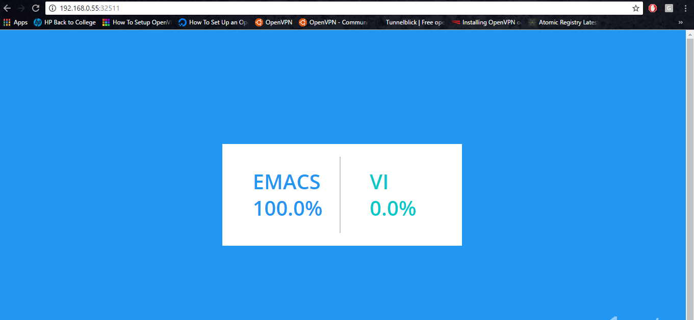

# Deploying Multi Tier Application Stack

In this tutorial, you would deploy a sample docker based application to kubernetes cluster by creating pods and deployments.


## Launching Application Stack
Create a yaml file to add our deployments and services in only single.

```
touch voting-app.yaml
```

Now add the below contents to the voting-app.yaml

```
apiVersion: extensions/v1beta1
kind: Deployment
metadata:
  labels:
    run: db
  name: db
  namespace: default
spec:
  replicas: 1
  template:
    metadata:
      labels:
        run: db
    spec:
      containers:
      - image: postgres:9.5
        imagePullPolicy: IfNotPresent
        name: db
        ports:
        - containerPort: 5432
          protocol: TCP
        terminationMessagePath: /dev/termination-log
      dnsPolicy: ClusterFirst
      restartPolicy: Always
---
apiVersion: v1
kind: Service
metadata:
  labels:
    run: db
  name: db
  namespace: default
spec:
  ports:
  - port: 5432
    protocol: TCP
    targetPort: 5432
  selector:
    run: db
---
apiVersion: extensions/v1beta1
kind: Deployment
metadata:
  labels:
    run: redis
  name: redis
  namespace: default
spec:
  replicas: 1
  template:
    metadata:
      labels:
        run: redis
    spec:
      containers:
      - image: redis:alpine
        imagePullPolicy: IfNotPresent
        name: redis
        ports:
        - containerPort: 6379
          protocol: TCP
      dnsPolicy: ClusterFirst
      restartPolicy: Always
---
apiVersion: v1
kind: Service
metadata:
  labels:
    run: redis
  name: redis
  namespace: default
spec:
  ports:
  - port: 6379
    protocol: TCP
    targetPort: 6379
  selector:
    run: redis
---
apiVersion: extensions/v1beta1
kind: Deployment
metadata:
  labels:
    run: voting-app
  name: voting-app
  namespace: default
spec:
  replicas: 1
  template:
    metadata:
      labels:
        run: voting-app
    spec:
      containers:
      - image: venkatsudharsanam/votingapp-python:10.0.0
        imagePullPolicy: Always
        name: voting-app
        ports:
        - containerPort: 80
          protocol: TCP
      dnsPolicy: ClusterFirst
      restartPolicy: Always
      securityContext: {}
---
apiVersion: v1
kind: Service
metadata:
  labels:
    run: voting-app
  name: voting-app
  namespace: default
spec:
  selector:
    run: voting-app
  ports:
  - port: 80
    protocol: TCP
    targetPort: 80
  type: LoadBalancer
---
apiVersion: extensions/v1beta1
kind: Deployment
metadata:
  labels:
    run: worker
  name: worker
  namespace: default
spec:
  replicas: 1
  template:
    metadata:
      labels:
        run: worker
    spec:
      containers:
      - image: suonto/worker
        imagePullPolicy: Always
        name: worker
      dnsPolicy: ClusterFirst
      restartPolicy: Always
      securityContext: {}
---
apiVersion: extensions/v1beta1
kind: Deployment
metadata:
  labels:
    run: result
  name: result
  namespace: default
spec:
  replicas: 1
  template:
    metadata:
      labels:
        run: result
    spec:
      containers:
      - image: venkatsudharsanam/result:10.0.0
        imagePullPolicy: Always
        name: result
        ports:
        - containerPort: 80
          protocol: TCP
      dnsPolicy: ClusterFirst
      restartPolicy: Always
      securityContext: {}
---
apiVersion: v1
kind: Service
metadata:
  labels:
    run: result
  name: result
  namespace: default
spec:
  selector:
    run: result
  ports:
  - port: 80
    protocol: TCP
    targetPort: 80
  type: LoadBalancer
```

Save the file and exit.


In this single yaml file we have the below deployments and services:
1. Voting App front end
2. Postgres DB
3. Redis
4. Result
5. Worker

### Deploying the sample application

To create deploy the sample applications,

```
kubectl create -f voting-app.yaml
```

Sample output is like:

```
kubectl create -f voting-app.yaml
deployment "db" created
service "db" created
deployment "redis" created
service "redis" created
deployment "voting-app" created
service "voting-app" created
deployment "worker" created
deployment "result" created
service "result" created
```


Now we have deployed the sample application.

#### To check it:

```
kubectl get service voting-app
```

Sample Output is:
```
kubectl get service voting-app
NAME         CLUSTER-IP      EXTERNAL-IP   PORT(S)        AGE
voting-app   10.97.104.243   <pending>     80:31808/TCP   1h
```
Here the port assigned is 31808, go to the browser and enter
```
masterip:31808
```


This will load the page where you can vote.

To check the result:
```
kubectl get service result
```
Sample Output is:
```
kubectl get service result
NAME      CLUSTER-IP      EXTERNAL-IP   PORT(S)        AGE
result    10.101.112.16   <pending>     80:32511/TCP   1h
```
Here the port assigned is 32511, go to the browser and enter
```
masterip:32511
```



This is the page where we can see the result of the vote.
