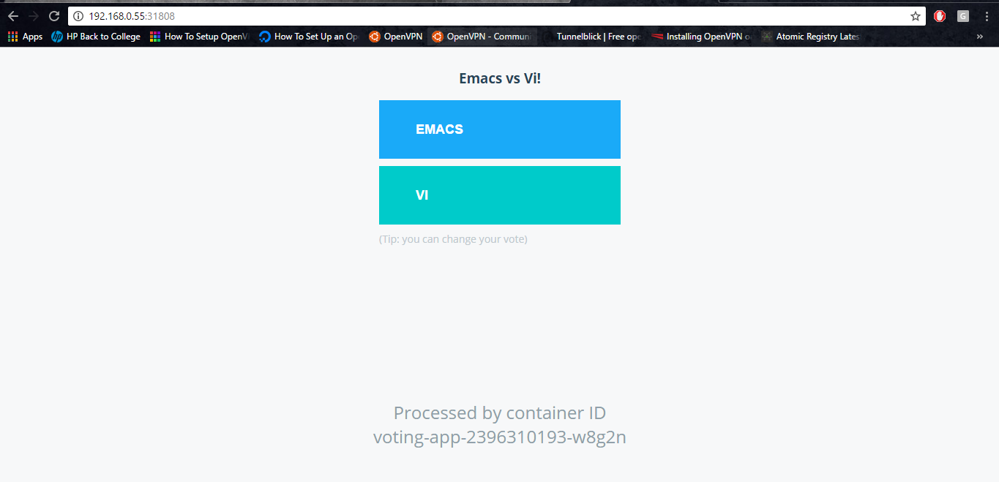

## Exposing Application with  a Service

Types of Services:
  * ClusterIP
  * NodePort
  * LoadBalancer
  * ExternalName

```
kubectl get pods
kubectl get svc
```

Sample Output:
```
NAME                READY     STATUS    RESTARTS   AGE
voting-appp-1j52x   1/1       Running   0          12m
voting-appp-pr2xz   1/1       Running   0          9m
voting-appp-qpxbm   1/1       Running   0          15m
```

Filename: vote-svc.yaml

```
---
apiVersion: v1
kind: Service
metadata:
  labels:
    role: svc
    tier: front
  name: vote-svc
  namespace: dev
spec:
  selector:
    app: vote
  ports:
  - port: 80
    protocol: TCP
    targetPort: 80
  type: NodePort
```

Save the file.

Now to create a service:

```
kubectl create -f vote_svc.yaml
kubectl get svc
```

Now to check which port the pod is connected
```
kubectl describe service vote-svc
```
Check for the Nodeport here

Sample Output
```
Name:                   vote-svc
Namespace:              dev
Labels:                 app=vote
Selector:               app=vote
Type:                   NodePort
IP:                     10.99.147.158
Port:                   <unset> 80/TCP
NodePort:               <unset> 30308/TCP
Endpoints:              10.40.0.2:80,10.40.0.3:80,10.40.0.4:80 + 1 more...
Session Affinity:       None
No events.
```

Go to browser and check hostip:NodePort

Here the node port is 30308.

Sample output will be:


